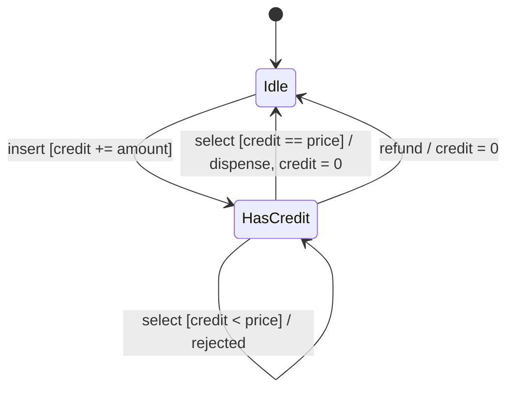

# Extended FSM (guards + context)

Adds context variables, guard conditions on transitions and actions that update the context. The state set stays small while behaviour depends on data.

## Use case
Vending machine with `credit` (cents) and a fixed `price = 75`.

| From | Event | Guard | Action | To |
|------|-------|-------|--------|----|
| Idle | insert(amount) | amount > 0 | credit += amount | HasCredit |
| HasCredit | insert(amount) | amount > 0 | credit += amount | HasCredit |
| HasCredit | select | credit >= price | credit -= price; dispense | Idle if credit == 0 else HasCredit |
| HasCredit | select | credit < price | none | HasCredit |
| HasCredit | refund | — | credit = 0 | Idle |

## Properties to test
Guard blocks under-funded purchase; credit never negative; change retained after purchase; refund zeroes credit.
