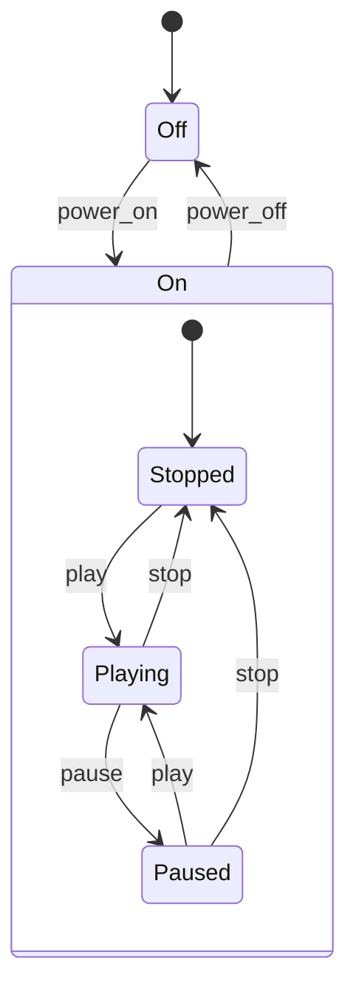

# Hierarchical (nested) FSM

States may contain sub-states. A transition on a parent applies to all of its children, which removes duplicated edges.

## Use case
Media player: `power_off` is valid from any state inside `On`, declared once on the parent.

| From | Event | To |
|------|-------|----|
| Off | power_on | On.Stopped (initial child) |
| On.Stopped | play | On.Playing |
| On.Playing | pause | On.Paused |
| On.Paused | play | On.Playing |
| On.Playing, On.Paused | stop | On.Stopped |
| On (any child) | power_off | Off |

## Properties to test
`power_off` works from each child; `play` while `Off` is invalid; re-entering `On` starts at `Stopped`.
