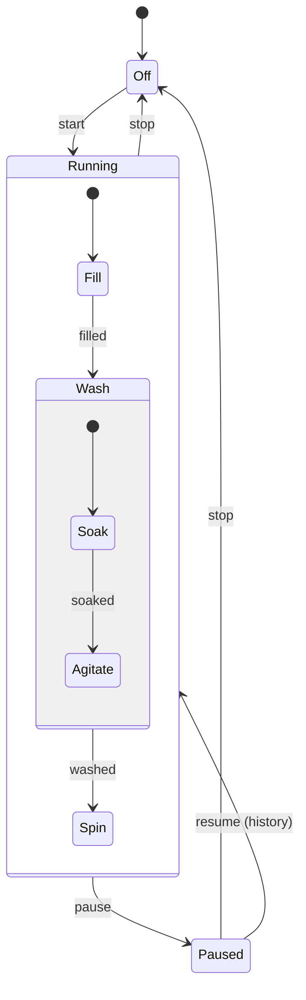

# FSM with history

A pseudo-state that remembers the last active child of a composite state. **Shallow** history restores only the direct child (entering it at its default sub-state); **deep** history restores the full nested configuration.

## Use case
Washing machine: `pause` interrupts a cycle, `resume` returns to where it was.

Variants of `resume`:

| Kind | Pause during `Wash.Agitate` then resume enters |
|------|------------------------------------------------|
| Shallow | `Wash.Soak` (Wash restored, its default child) |
| Deep | `Wash.Agitate` (exact configuration) |
| None | `Fill` (initial) |

| From | Event | To |
|------|-------|----|
| Off | start | Running.Fill |
| Fill | filled | Wash.Soak |
| Soak | soaked | Wash.Agitate |
| Wash | washed | Spin |
| Running | pause | Paused |
| Paused | resume | Running (history) |
| Running, Paused | stop | Off |
