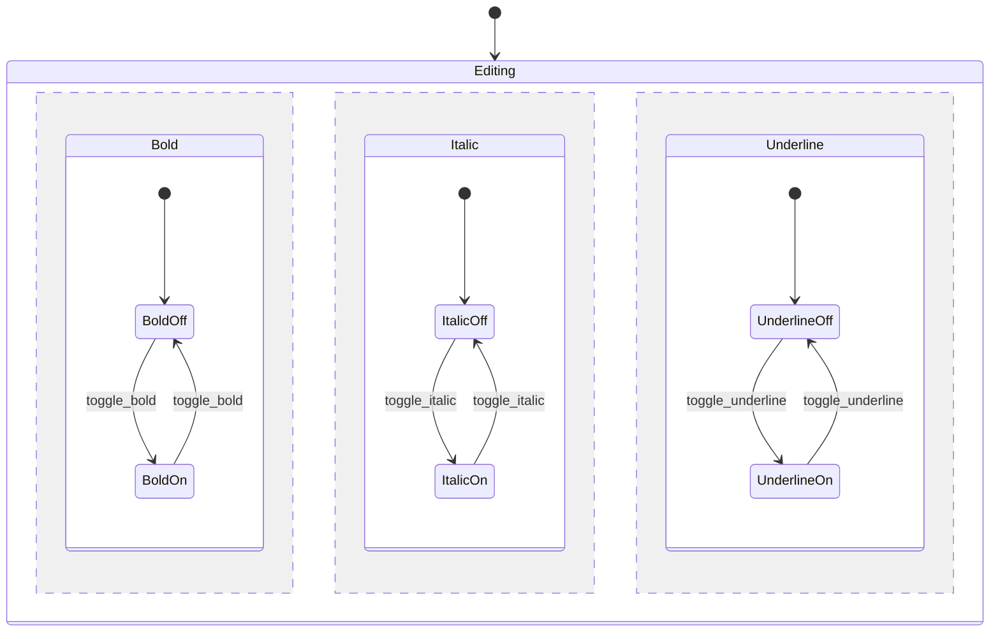

# Parallel (orthogonal) regions

A composite state with several regions that are all active at once; an event is delivered to every region and each reacts independently. This avoids the product-state explosion (here 2 x 2 x 2 = 8 combined states vs 6 region states).

## Use case
Text style: bold, italic and underline toggle independently.

| Region | Event | Effect |
|--------|-------|--------|
| Bold | toggle_bold | BoldOff <-> BoldOn |
| Italic | toggle_italic | ItalicOff <-> ItalicOn |
| Underline | toggle_underline | UnderlineOff <-> UnderlineOn |

The active configuration is a tuple, e.g. `(BoldOn, ItalicOff, UnderlineOn)`. Toggling one region leaves the others unchanged.

## In XState
Machine: [`textStyle.machine.ts`](../../xstate/src/machines/textStyle.machine.ts) (textStyle). Scenario tests: [`designs.unit.test.ts`](../../xstate/test/designs.unit.test.ts). Toggles are independent; all 8 style combinations are reached (8 states, 24 transitions).
