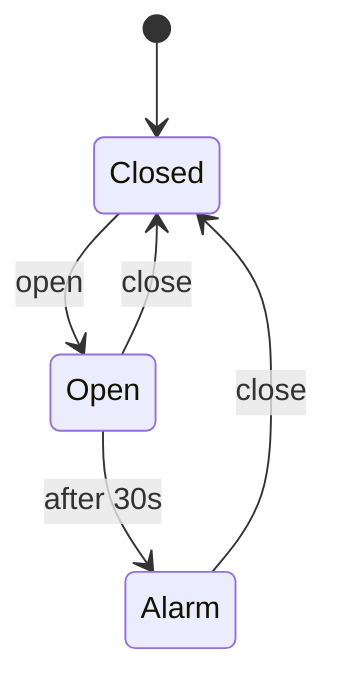

# Timed FSM

Transitions can fire automatically after a state has been active for a duration (timeout).

## Use case
Door alarm: if the door stays open for 30 s the alarm sounds.

| From | Trigger | To |
|------|---------|----|
| Closed | open | Open |
| Open | close | Closed |
| Open | timeout 30 s | Alarm |
| Alarm | close | Closed |

The timer starts on entering `Open` and is cancelled on leaving it.

## In XState
Machine: [`doorAlarm.machine.ts`](../../xstate/src/machines/doorAlarm.machine.ts) (doorAlarm). Scenario tests: [`designs.unit.test.ts`](../../xstate/test/designs.unit.test.ts). No alarm at 29.999 s; alarm at 30 s; closing cancels the timer; re-opening restarts it (`SimulatedClock`). Checked: siren only in `alarm`, `closed` always reachable.
