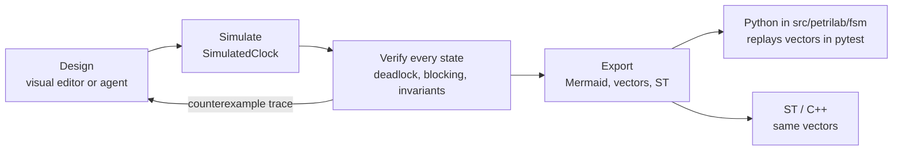

# XState as design and verification layer

The Python libraries in [library evaluation](library-evaluation.md) implement FSMs well, but none can enumerate a statechart's state space, and none has a visual editor. [XState v5](https://stately.ai/docs) (TypeScript) fills that gap: machines are plain data, `transition(machine, snapshot, event)` is a pure function, and the XState VS Code extension edits machines as diagrams. The subproject [`xstate/`](../../xstate/README.md) uses it to design EFSMs, check them exhaustively and hand verified test vectors to the Python implementations.



## EFSM concepts in XState v5

| Concept | XState v5 | Repo design |
|---------|-----------|-------------|
| Hierarchy | nested `states` + `initial` | [hierarchical](hierarchical.md) |
| Guards + context | `guard`, `context`, `assign` in `setup()` | [extended](extended.md) |
| Timeouts | `after: { NAME: … }` + `setup.delays` | [timed](timed.md) |
| Parallel regions | `type: 'parallel'` | [parallel](parallel.md) |
| Moore outputs | state `tags`, read with `hasTag` | [Moore vs Mealy](moore-mealy.md) |
| History | `type: 'history'` | [history](history.md) |

Semantics to remember: the deepest state that handles an event wins; guarded branches are tried in order (last unguarded = else); leaving a state cancels its timers; one event runs to completion before the next.

## Verification

[`explore.ts`](../../xstate/src/analysis/explore.ts) is a breadth-first search over (state value, context). In each state it fires every event in the spec (payload variants listed separately) and every armed timer. Results use the vocabulary of [`analysis.py`](../../src/petrilab/petri/analysis.py):

| Check | Definition |
|-------|------------|
| Deadlock | non-final state where no event changes anything (dead marking) |
| Blocking | state from which no marked (home) state is reachable |
| Invariant | predicate that must hold in every reachable state |
| Unreachable | declared state never entered |

Every problem comes with the shortest event trace that reaches it. Machines with unbounded counters (vending credit) use `maxDepth`: invariants hold on the explored part, frontier states are not judged.

## Cross-checks

| Check | Result |
|-------|--------|
| Dining philosophers, XState parallel EFSM vs Petri net, n = 2, 3, 4 | identical state, edge and dead-state counts (6/8/1, 14/27/1, 34/88/1 naive; 3/4/0, 4/6/0, 7/16/0 atomic) |
| XState deadlock trace replayed as Petri firing sequence | reaches the dead marking for n = 2, 3, 4 |
| Door alarm vectors vs sismic `DoorAlarm` | 4 vectors pass |
| Vending vectors (depth 4) vs python-statemachine `VendingMachine` | 129 vectors pass |
| Fill station vectors vs hand-written `FillStation` | 135 vectors pass |
| Every vector replayed on the live XState interpreter with `SimulatedClock` | pure model and runtime agree |

Tests: [`test_xstate_vectors.py`](../../tests/fsm/test_xstate_vectors.py), [`test_xstate_crosscheck.py`](../../tests/petri/test_xstate_crosscheck.py), and the vitest suite in `xstate/test/`.

## Gotchas
- XState ignores events with no transition; `python-statemachine` with `allow_event_without_transition = False` raises. Vectors only contain state-changing steps, so both agree on them.
- Vectors use milliseconds; sismic's clock uses seconds.
- The VS Code visual editor parses literal configs only. The philosophers machine is built by a factory (to vary n) and is for analysis, not editing.
- Stately's typegen is XState v4 only. In v5 `setup({ types })` types everything.
- Timers are explored as events that may fire whenever armed, so the analysis can include orderings impossible in real time. It over-approximates (false alarms possible, misses impossible); for timing races use a timed model, cf. [timed nets](../petri/timed.md).

## Daily use

```bash
cd xstate && npm ci
npm run verify          # typecheck + export + analyze + vitest
npm run sim -- fill     # interactive: type events, `wait 5000`, `quit`
```

Edit a machine, run `npm run verify`, commit the machine together with `xstate/generated/`. Rules for coding agents: [`xstate/AGENTS.md`](../../xstate/AGENTS.md).
