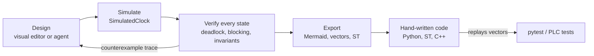

# XState as design and verification layer

Every FSM in this repo is a [XState v5](https://stately.ai/docs) machine in [`xstate/`](../../xstate/README.md). Machines are plain data, `transition(machine, snapshot, event)` is a pure function, and the XState VS Code extension edits machines as diagrams. That makes three things possible that Python statechart libraries lack ([decision record](library-evaluation.md)): visual editing, exhaustive checking of every reachable state, and test vectors that prove a hand-written implementation equals the model.



## EFSM concepts in XState v5

| Concept | XState v5 | Repo design |
|---------|-----------|-------------|
| Hierarchy | nested `states` + `initial` | [hierarchical](hierarchical.md) |
| Guards + context | `guard`, `context`, `assign` in `setup()` | [extended](extended.md) |
| Timeouts | `after: { NAME: … }` + `setup.delays` | [timed](timed.md) |
| Parallel regions | `type: 'parallel'` | [parallel](parallel.md) |
| Moore outputs | state `tags`, read with `hasTag` | [Moore vs Mealy](moore-mealy.md) |
| History | `type: 'history'` | [history](history.md) |

Semantics to remember: the deepest state that handles an event wins; guarded branches are tried in order (last unguarded = else); leaving a state cancels its timers; one event runs to completion before the next.

## Verification

[`explore.ts`](../../xstate/src/analysis/explore.ts) is a breadth-first search over (state value, context, remembered history). In each state it fires every event in the spec (payload variants listed separately) and every armed timer. Results use the vocabulary of [`analysis.py`](../../src/petrilab/petri/analysis.py):

| Check | Definition |
|-------|------------|
| Deadlock | non-final state where no event changes anything (dead marking) |
| Blocking | state from which no marked (home) state is reachable |
| Invariant | predicate that must hold in every reachable state |
| Unreachable | declared state never entered |

Every problem comes with the shortest event trace that reaches it. Machines with unbounded counters (vending credit) use `maxDepth`: invariants hold on the explored part, frontier states are not judged.

## Cross-checks

| Check | Result |
|-------|--------|
| Dining philosophers, XState parallel EFSM vs Petri net, n = 2, 3, 4 | identical state, edge and dead-state counts (6/8/1, 14/27/1, 34/88/1 naive; 3/4/0, 4/6/0, 7/16/0 atomic) |
| XState deadlock trace replayed as Petri firing sequence | reaches the dead marking for n = 2, 3, 4 |
| Moore vs Mealy detectors as one product machine | outputs agree in all 3 reachable states (exact equivalence) |
| Fill station vectors vs hand-written Python `FillStation` | 135 vectors pass |
| Every vector replayed on the live XState interpreter with `SimulatedClock` | pure model and runtime agree |

Tests: [`test_fill_station.py`](../../tests/fsm/test_fill_station.py), [`test_xstate_crosscheck.py`](../../tests/petri/test_xstate_crosscheck.py), and the vitest suite in `xstate/test/`.

## Gotchas
- XState ignores events with no transition. Vectors only contain state-changing steps, so an implementation may ignore or reject unknown events.
- Vectors use milliseconds.
- History is stored in the snapshot's `historyValue`, outside value and context. The explorer includes it in state identity; without it, `paused` states remembering different children would be merged.
- The VS Code visual editor parses literal configs only. The philosophers machine is built by a factory (to vary n) and is for analysis, not editing.
- Stately's typegen is XState v4 only. In v5 `setup({ types })` types everything.
- Timers are explored as events that may fire whenever armed, so the analysis can include orderings impossible in real time. It over-approximates timing (false alarms possible); with every relevant event listed and no depth bound, no reachable violation is missed; for timing races use a timed model, cf. [timed nets](../petri/timed.md).

## Daily use

```bash
cd xstate && npm ci
npm run verify          # typecheck + export + analyze + vitest
npm run sim -- fill     # interactive: type events, `wait 5000`, `quit`
```

Edit a machine, run `npm run verify`, commit the machine together with `xstate/generated/` (diagrams, vectors, ST, reports). Rules for coding agents: [`xstate/AGENTS.md`](../../xstate/AGENTS.md).
