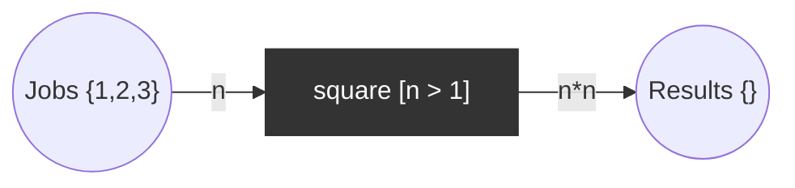

# Coloured Petri net (CPN)

Tokens carry values (colours); arcs carry expressions over variables; transitions have guards. Compresses many similar sub-nets into one.

## Use case
Jobs are integers. `square` fires for a job `n` with guard `n > 1` and produces `n*n`. Initial marking: `Jobs = {1, 2, 3}`, `Results = {}`.

Colour set `INT`; places `Jobs: INT`, `Results: INT`.

| Step | Jobs | Results |
|------|------|---------|
| initial | {1,2,3} | {} |
| square(n=2) | {1,3} | {4} |
| square(n=3) | {1} | {4,9} (dead) |

Token `1` is blocked by the guard: the final marking is **dead but not empty**, which is the point of the example. Unfolding to a P/T net would need one transition per colour.

## Properties
- 4 reachable markings (firing 2 and 3 in either order): initial, `{1,3}/{4}`, `{1,2}/{9}`, `{1}/{4,9}`.
- Exactly one dead marking, `{1}/{4,9}`.
