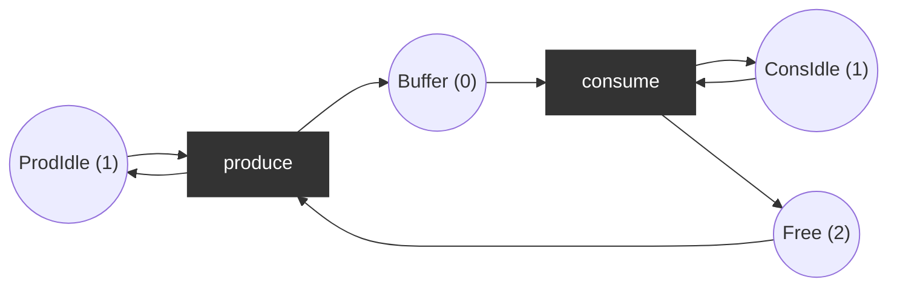
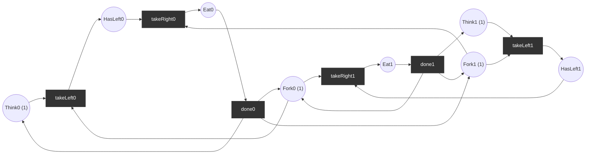
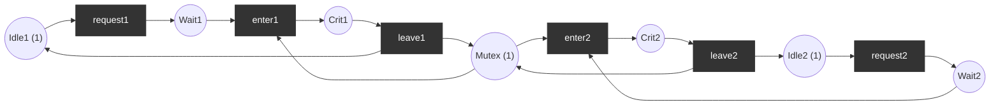
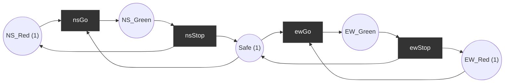

# Classic examples

## 1. Producer/consumer (bounded buffer, capacity 2)
`produce` needs a free slot and puts an item in the buffer; `consume` takes an item and frees the slot.

Places `(ProdIdle, Free, Buffer, ConsIdle)`; `produce`: pre (1,1,0,0) post (1,0,1,0); `consume`: pre (0,0,1,1) post (0,1,0,1).
- Bounded (2), live, deadlock-free; P-invariants: `Free + Buffer = 2`, `ProdIdle = 1`, `ConsIdle = 1`.

## 2. Dining philosophers (n = 2 shown; implemented for any n)
Each philosopher `i` has `Think_i (1)`, `HasLeft_i`, `Eat_i`; forks `Fork_i (1)`; philosopher `i` takes left fork `Fork_i`, then right fork `Fork_{(i+1) mod n}`.

**Deadlock**: both take their left fork -> marking `HasLeft0 = HasLeft1 = 1`, all forks taken, nothing enabled.

**Fix (atomic pickup)**: replace `takeLeft_i` and `takeRight_i` by a single transition `take_i` consuming `Think_i`, `Fork_i`, `Fork_{i+1}` and producing `Eat_i`. No dead marking exists; the net is deadlock-free and live. Invariant: `Fork_i + Eat_i + Eat_{i-1} = 1`.

## 3. Mutual exclusion
Two processes share a `Mutex (1)`. Per process `k`: `Idle_k (1)`, `Wait_k`, `Crit_k`; transitions `request_k` (Idle -> Wait), `enter_k` (Wait + Mutex -> Crit), `leave_k` (Crit -> Idle + Mutex).

Safety: `Crit1 + Crit2 <= 1` in every reachable marking (follows from invariant `Mutex + Crit1 + Crit2 = 1`). Deadlock-free and live. Marking count: 8.

## 4. Traffic lights for a crossing
Two roads share a `Safe` token: a road may turn green only by taking `Safe`, and returns it when turning red. Initial `NS_Red = EW_Red = Safe = 1`.

Safety: `NS_Green + EW_Green <= 1` (invariant `Safe + NS_Green + EW_Green = 1`). 3 reachable markings, live, deadlock-free.
