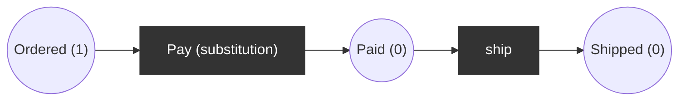
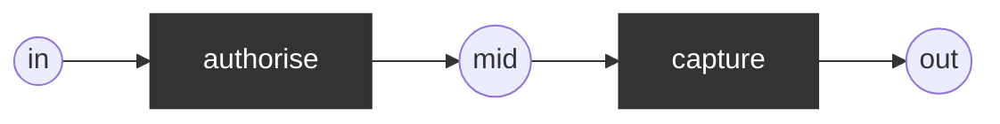

# Hierarchical Petri net

A *substitution transition* stands for a whole subnet with designated port places. The behaviour is defined by flattening: fuse the subnet's input/output ports with the surrounding places.

## Use case
Order handling: top level has a substitution transition `Pay`.

Top level:

Subnet `Pay` (ports `in` <-> `Ordered`, `out` <-> `Paid`):

## Flattened net
Internal names are prefixed with the substitution transition's name. Places `(Ordered, Pay.mid, Paid, Shipped)`, transitions `Pay.authorise: Ordered -> Pay.mid`, `Pay.capture: Pay.mid -> Paid`, `ship: Paid -> Shipped`. Initial `(1,0,0,0)`.

Reachable markings: a chain of 4, final (0,0,0,1) dead (terminal). 1-safe; P-invariant: sum of all places = 1.
