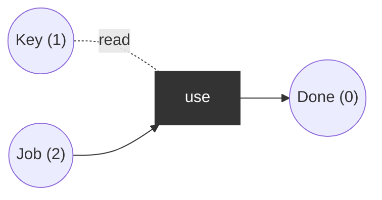

# Inhibitor and read arcs

Inhibitor arcs (`--o`) enable a transition only when the place has **fewer** than `weight` tokens (a zero test for weight 1). Read arcs (dotted) require tokens without consuming them. Both go beyond plain P/T nets: inhibitor arcs give Turing power; here they make an otherwise unbounded net bounded.

## Bounded counter (inhibitor)
`put` is a source transition (always producing), but is inhibited when `Buf` holds 2 tokens. Initial: `Buf = 0`.

Without the inhibitor arc the net is unbounded. With it: markings `Buf in {0,1,2}`, bounded (2-bounded), live (always `put` or `get` enabled), never dead.

## Read arc
`use` needs a `Key` token but leaves it in place; `Job` tokens are consumed. Initial: `Key=1, Job=2, Done=0`.

Places `(Key, Job, Done)`. `use`: pre (1r, 1, 0) where `r` = read, post (0, 0, 1). Reachable: (1,2,0), (1,1,1), (1,0,2). `Key` stays 1 throughout. Dead marking (1,0,2). Without `Key` (marking (0,2,0)) `use` is never enabled: dead from the start.
