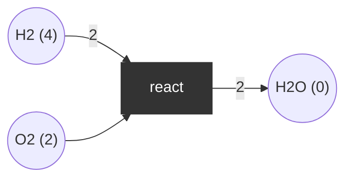

# Place/transition net

A bipartite graph of places and transitions with weighted arcs; the state is a marking (tokens per place).

## Use case
Water synthesis `2 H2 + O2 -> 2 H2O` with weighted arcs. Initial marking: 4 H2, 2 O2.

Places order `(H2, O2, H2O)`.

| Transition | Pre | Post |
|------------|-----|------|
| react | (2, 1, 0) | (0, 0, 2) |

Reachable markings: (4,2,0) -> (2,1,2) -> (0,0,4). The last is dead (a deadlock, here a *desired* terminal state).

## Properties
- Bounded; 3 reachable markings, 1 dead marking (0,0,4).
- P-invariants (weight vectors over `(H2, O2, H2O)`): `(1,0,1)` gives `H2 + H2O = 4`; `(0,2,1)` gives `2*O2 + H2O = 4`.
- Not live (terminates).
