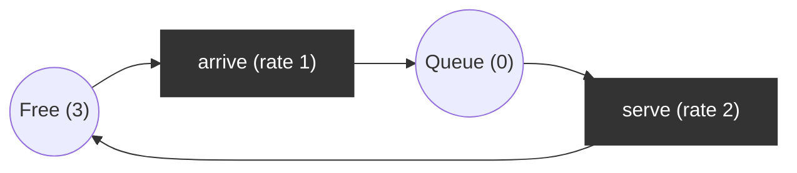

# Stochastic Petri net (SPN)

Transitions fire after exponentially distributed delays with a rate; the reachability graph with rates is a continuous-time Markov chain (CTMC), so steady-state performance metrics can be computed.

## Use case
M/M/1/K queue: arrival rate `lambda = 1`, service rate `mu = 2`, capacity `K = 3`. Initial: `Free = 3, Queue = 0`.

Markings are determined by `Queue = n`, `0 <= n <= 3`. P-invariant: `Free + Queue = 3`.

CTMC birth-death chain: `n -> n+1` at rate 1 (if `n < 3`), `n -> n-1` at rate 2 (if `n > 0`).

Analytic steady state with `rho = lambda/mu = 0.5`: `pi_n = rho^n (1-rho) / (1-rho^(K+1))` = `(8, 4, 2, 1)/15`.

## Properties
Solve `pi Q = 0, sum pi = 1` numerically from the net and compare with the analytic values.
