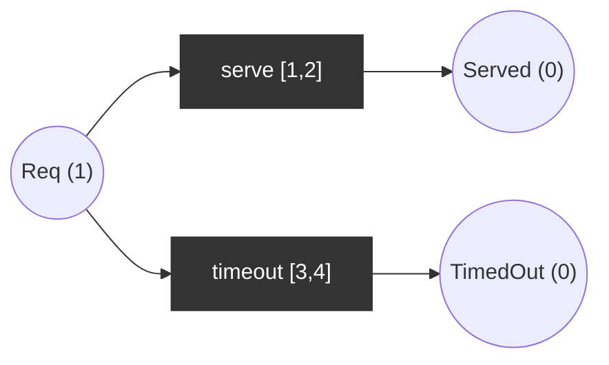

# Timed Petri net (time Petri net, TPN)

Each transition has a firing interval `[eft, lft]` relative to the moment it became enabled. It may fire only inside the interval and **must** fire (or be disabled) by `lft`. Time can elapse only while no enabled transition would be forced to fire late.

## Use case
A request is served quickly (`serve` in [1,2]) or times out (`timeout` in [3,4]); both compete for the same token. Initial: `Req = 1`.

| Semantics | Reachable markings |
|-----------|--------------------|
| Untimed | (1,0,0), (0,1,0) Served, (0,0,1) TimedOut |
| Timed | (1,0,0), (0,1,0) only |

In the timed net `serve` is forced to fire by t=2, before `timeout` is allowed at t=3, so `timeout` is **dead** (never fires). Changing `serve` to [3,5] makes both firable: `timeout` can fire at t=3 while `serve` is still enabled.

## Properties
- Place order `(Req, Served, TimedOut)`.
- Timed state = (marking, clocks per enabled transition).
- Checks: `timeout` unreachable in the timed net, reachable in the untimed version and with `serve` in [3,5].
