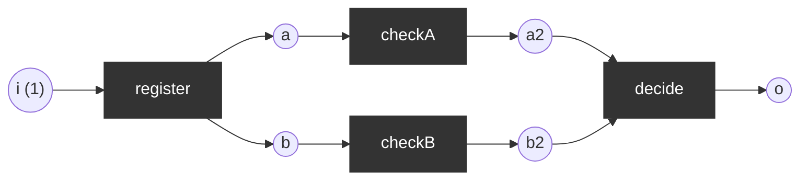
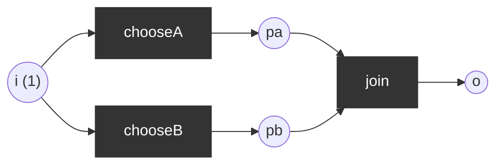

# Workflow nets (WF-nets) and soundness

A WF-net has a single source place `i`, a single sink place `o`, and every node lies on a path from `i` to `o`. It is **sound** if (1) from every reachable marking, the final marking `[o]` is reachable (option to complete), (2) whenever `o` is marked, nothing else is (proper completion), (3) no transition is dead.

## Sound: parallel review
`register` splits (AND) into two checks, `decide` joins.

## Unsound: XOR split feeding an AND join
Two alternative transitions choose one branch, but `join` needs both.

After `chooseA` the marking `[pa]` is dead and `o` is unreachable: **deadlock**, option-to-complete violated, `join` is dead.

| Net | Sound | Reason |
|-----|-------|--------|
| Parallel review | yes | every reachable marking can reach `[o]`; no leftovers |
| XOR/AND mismatch | no | dead marking `[pa]`/`[pb]`, dead transition `join` |
