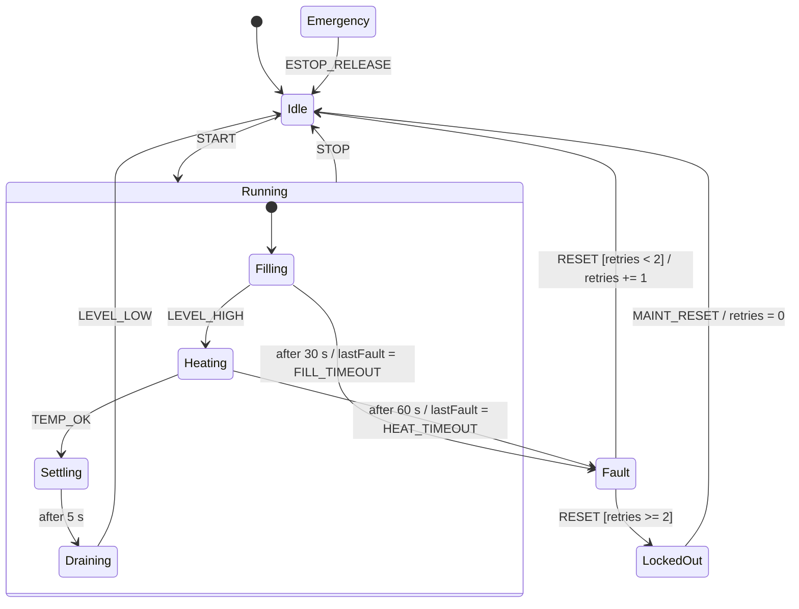

# Fill station (automation EFSM)

Combines every FSM variant from this folder in one control scheme: hierarchy, guards, context variables, timeouts, a root-level emergency transition and Moore outputs. Designed and verified in XState first ([workflow](xstate.md)), then implemented by hand in Python.

## Use case
A tank fills, heats, settles and drains. Fill and heat are supervised by timeouts. A fault can be reset twice; the third fault locks the station out until maintenance. `ESTOP` works from every state.

`ESTOP` from any state goes to `Emergency` (omitted from the diagram for readability).

| From | Trigger | Guard | Action | To | Outputs in target |
|------|---------|-------|--------|----|-------------------|
| Idle | START | — | — | Running.Filling | INLET |
| Running.Filling | LEVEL_HIGH | — | — | Running.Heating | HEATER |
| Running.Filling | timeout 30 s | — | lastFault = FILL_TIMEOUT | Fault | — |
| Running.Heating | TEMP_OK | — | — | Running.Settling | — |
| Running.Heating | timeout 60 s | — | lastFault = HEAT_TIMEOUT | Fault | — |
| Running.Settling | timeout 5 s | — | — | Running.Draining | OUTLET |
| Running.Draining | LEVEL_LOW | — | — | Idle | — |
| Running.* | STOP | — | — | Idle | — |
| Fault | RESET | retries < 2 | retries += 1 | Idle | — |
| Fault | RESET | retries >= 2 | — | LockedOut | — |
| LockedOut | MAINT_RESET | — | retries = 0, lastFault = none | Idle | — |
| any | ESTOP | — | — | Emergency | — |
| Emergency | ESTOP_RELEASE | — | — | Idle | — |

## Properties (checked exhaustively in XState, 50 states)
Inlet and outlet never open together; heater only with both valves closed; no outputs in emergency; retry counter bounded by 2; idle reachable from every state (nonblocking); no deadlock; every declared state reachable.

## Artefacts
- Model: [`fillStation.machine.ts`](../xstate/src/machines/fillStation.machine.ts), checks in [`fillStation.checks.ts`](../xstate/src/specs/fillStation.checks.ts).
- Generated: [Mermaid](../xstate/generated/diagrams/fillStation.md), [vectors](../xstate/generated/vectors/fill-station.json) (135, one per transition), [ST skeleton](../xstate/generated/st/FB_fillStation.st).
- Python: [`fill_station.py`](../../src/petrilab/fsm/fill_station.py), proven against the vectors in [`test_fill_station.py`](../../tests/fsm/test_fill_station.py).
