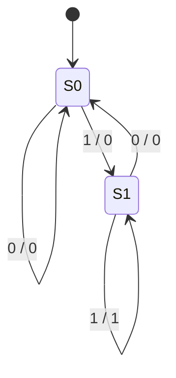
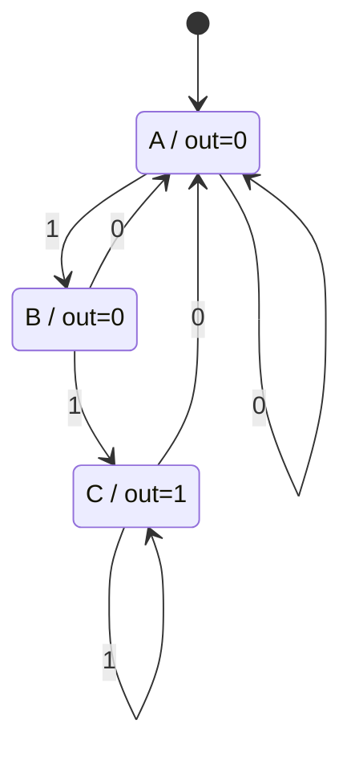

# Moore vs Mealy

- **Moore**: output depends on the current state only.
- **Mealy**: output depends on the current state and the input (emitted on transitions).

## Use case
Detect two consecutive `1`s in a bit stream (overlapping). Output `1` when detected.

### Mealy (outputs on edges, `input/output`)

| State | Input | Next | Output |
|-------|-------|------|--------|
| S0 | 0 | S0 | 0 |
| S0 | 1 | S1 | 0 |
| S1 | 0 | S0 | 0 |
| S1 | 1 | S1 | 1 |

### Moore (outputs in states)

| State | Output | Input 0 | Input 1 |
|-------|--------|---------|---------|
| A | 0 | A | B |
| B | 0 | A | C |
| C | 1 | A | C |

For input `0110111`: Mealy emits `0010011` immediately on the transition; Moore needs one extra state (C) and its output is observed after the transition, so the sequences match when read after each step.

## In XState
Machine: [`elevenDetector.machine.ts`](../xstate/src/machines/elevenDetector.machine.ts) (elevenDetector). Scenario tests: [`designs.unit.test.ts`](../xstate/test/designs.unit.test.ts). Both detectors run as parallel regions of one machine on the same bits. The invariant "Moore and Mealy outputs agree" holds in all 3 reachable product states: an exact equivalence proof. A Moore variant with the output on the wrong state is caught after the single input `one`.
