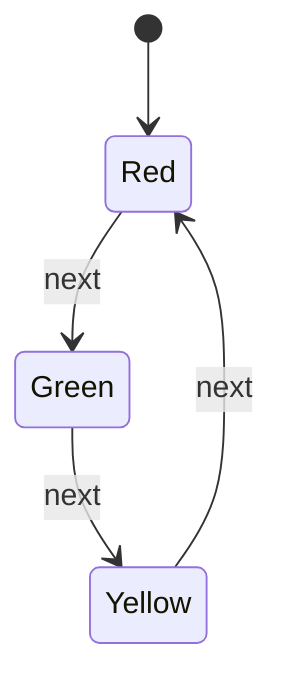
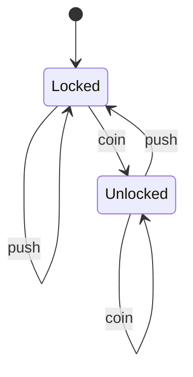

# Regular FSM

A flat, deterministic machine: a finite set of states, one active at a time, and a transition function `(state, event) -> state`. Events with no matching transition are invalid.

## Use case
Traffic light (cyclic) and turnstile (event-driven, with self-loops).

## Traffic light

| From | Event | To |
|------|-------|----|
| Red | next | Green |
| Green | next | Yellow |
| Yellow | next | Red |

## Turnstile

| From | Event | To |
|------|-------|----|
| Locked | coin | Unlocked |
| Locked | push | Locked |
| Unlocked | push | Locked |
| Unlocked | coin | Unlocked |

## In XState
Machine: [`regular.machine.ts`](../xstate/src/machines/regular.machine.ts) (trafficLight, turnstile). Scenario tests: [`designs.unit.test.ts`](../xstate/test/designs.unit.test.ts). Every listed transition works; unknown events are ignored (XState does not raise). Checked: exactly one lamp lit, release only when unlocked, red/locked always reachable.
