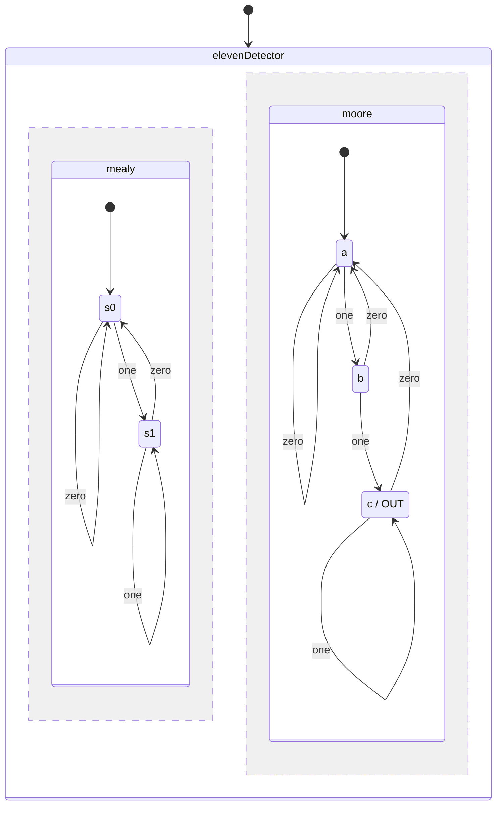

# elevenDetector

```mermaid
stateDiagram-v2
  state "elevenDetector" as elevenDetector {
    state "mealy" as elevenDetector_mealy {
      state "s0" as elevenDetector_mealy_s0
      state "s1" as elevenDetector_mealy_s1
      [*] --> elevenDetector_mealy_s0
      elevenDetector_mealy_s0 --> elevenDetector_mealy_s0 : zero
      elevenDetector_mealy_s0 --> elevenDetector_mealy_s1 : one
      elevenDetector_mealy_s1 --> elevenDetector_mealy_s0 : zero
      elevenDetector_mealy_s1 --> elevenDetector_mealy_s1 : one
    }
    --
    state "moore" as elevenDetector_moore {
      state "a" as elevenDetector_moore_a
      state "b" as elevenDetector_moore_b
      state "c / OUT" as elevenDetector_moore_c
      [*] --> elevenDetector_moore_a
      elevenDetector_moore_a --> elevenDetector_moore_a : zero
      elevenDetector_moore_a --> elevenDetector_moore_b : one
      elevenDetector_moore_b --> elevenDetector_moore_a : zero
      elevenDetector_moore_b --> elevenDetector_moore_c : one
      elevenDetector_moore_c --> elevenDetector_moore_a : zero
      elevenDetector_moore_c --> elevenDetector_moore_c : one
    }
  }
  [*] --> elevenDetector
```
