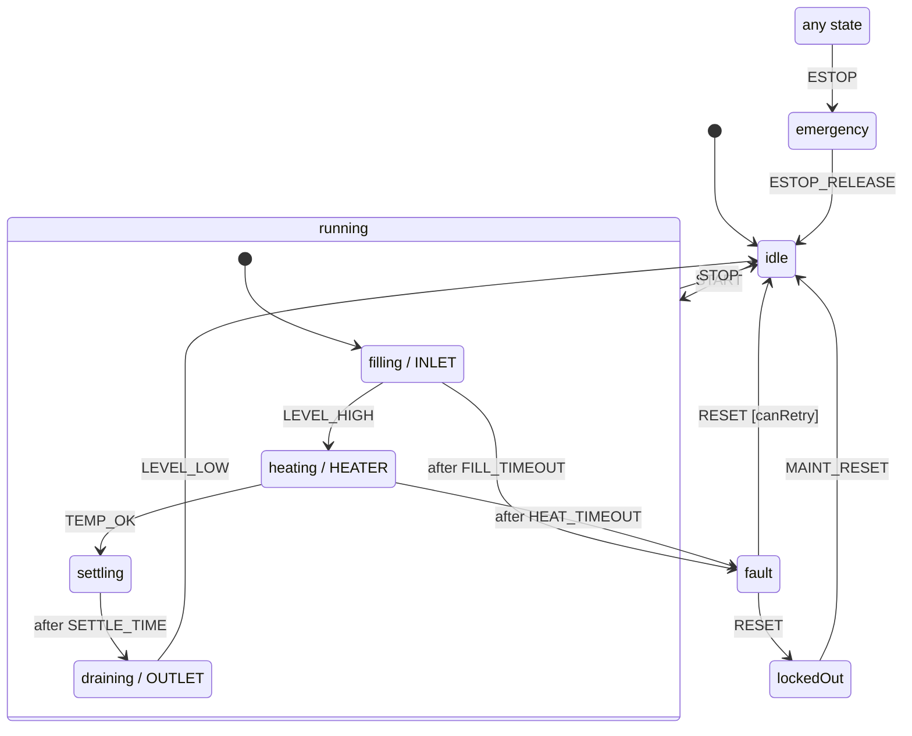

# fillStation

```mermaid
stateDiagram-v2
  state "idle" as fillStation_idle
  state "running" as fillStation_running {
    state "filling / INLET" as fillStation_running_filling
    state "heating / HEATER" as fillStation_running_heating
    state "settling" as fillStation_running_settling
    state "draining / OUTLET" as fillStation_running_draining
    [*] --> fillStation_running_filling
  }
  state "fault" as fillStation_fault
  state "lockedOut" as fillStation_lockedOut
  state "emergency" as fillStation_emergency
  [*] --> fillStation_idle
  state "any state" as ANY
  fillStation_running_filling --> fillStation_running_heating : LEVEL_HIGH
  fillStation_running_filling --> fillStation_fault : after FILL_TIMEOUT
  fillStation_running_heating --> fillStation_running_settling : TEMP_OK
  fillStation_running_heating --> fillStation_fault : after HEAT_TIMEOUT
  fillStation_running_settling --> fillStation_running_draining : after SETTLE_TIME
  fillStation_running_draining --> fillStation_idle : LEVEL_LOW
  fillStation_idle --> fillStation_running : START
  fillStation_running --> fillStation_idle : STOP
  fillStation_fault --> fillStation_idle : RESET [canRetry]
  fillStation_fault --> fillStation_lockedOut : RESET
  fillStation_lockedOut --> fillStation_idle : MAINT_RESET
  fillStation_emergency --> fillStation_idle : ESTOP_RELEASE
  ANY --> fillStation_emergency : ESTOP
```
