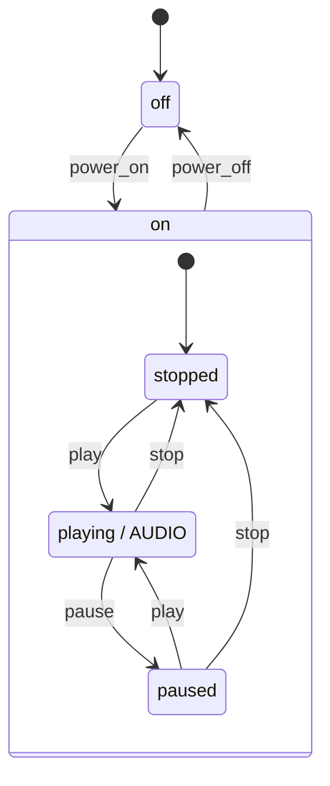

# mediaPlayer

```mermaid
stateDiagram-v2
  state "off" as mediaPlayer_off
  state "on" as mediaPlayer_on {
    state "stopped" as mediaPlayer_on_stopped
    state "playing / AUDIO" as mediaPlayer_on_playing
    state "paused" as mediaPlayer_on_paused
    [*] --> mediaPlayer_on_stopped
  }
  [*] --> mediaPlayer_off
  mediaPlayer_on_stopped --> mediaPlayer_on_playing : play
  mediaPlayer_on_playing --> mediaPlayer_on_paused : pause
  mediaPlayer_on_playing --> mediaPlayer_on_stopped : stop
  mediaPlayer_on_paused --> mediaPlayer_on_playing : play
  mediaPlayer_on_paused --> mediaPlayer_on_stopped : stop
  mediaPlayer_off --> mediaPlayer_on : power_on
  mediaPlayer_on --> mediaPlayer_off : power_off
```
