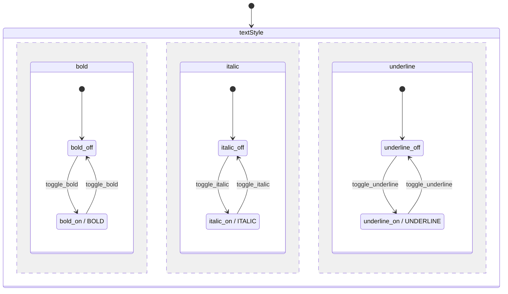

# textStyle

```mermaid
stateDiagram-v2
  state "textStyle" as textStyle {
    state "bold" as textStyle_bold {
      state "bold_off" as textStyle_bold_bold_off
      state "bold_on / BOLD" as textStyle_bold_bold_on
      [*] --> textStyle_bold_bold_off
      textStyle_bold_bold_off --> textStyle_bold_bold_on : toggle_bold
      textStyle_bold_bold_on --> textStyle_bold_bold_off : toggle_bold
    }
    --
    state "italic" as textStyle_italic {
      state "italic_off" as textStyle_italic_italic_off
      state "italic_on / ITALIC" as textStyle_italic_italic_on
      [*] --> textStyle_italic_italic_off
      textStyle_italic_italic_off --> textStyle_italic_italic_on : toggle_italic
      textStyle_italic_italic_on --> textStyle_italic_italic_off : toggle_italic
    }
    --
    state "underline" as textStyle_underline {
      state "underline_off" as textStyle_underline_underline_off
      state "underline_on / UNDERLINE" as textStyle_underline_underline_on
      [*] --> textStyle_underline_underline_off
      textStyle_underline_underline_off --> textStyle_underline_underline_on : toggle_underline
      textStyle_underline_underline_on --> textStyle_underline_underline_off : toggle_underline
    }
  }
  [*] --> textStyle
```
