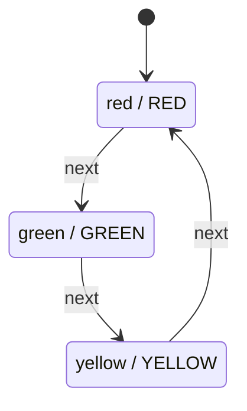

# trafficLight

```mermaid
stateDiagram-v2
  state "red / RED" as trafficLight_red
  state "green / GREEN" as trafficLight_green
  state "yellow / YELLOW" as trafficLight_yellow
  [*] --> trafficLight_red
  trafficLight_red --> trafficLight_green : next
  trafficLight_green --> trafficLight_yellow : next
  trafficLight_yellow --> trafficLight_red : next
```
