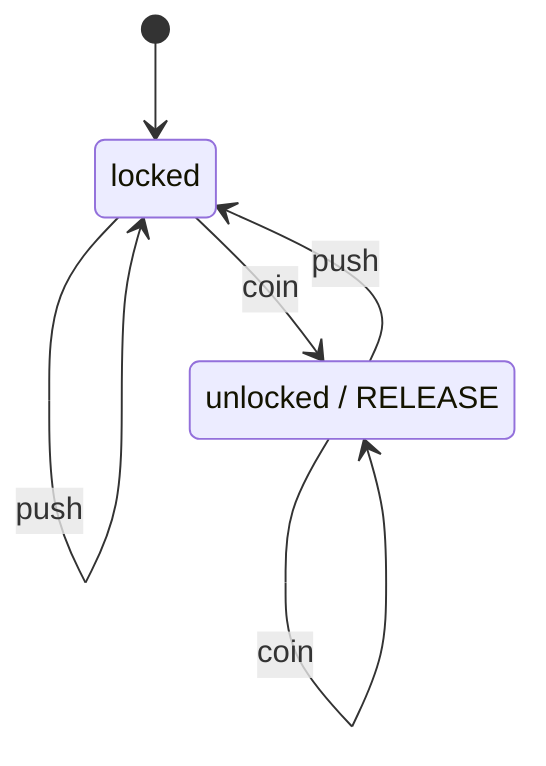

# turnstile

```mermaid
stateDiagram-v2
  state "locked" as turnstile_locked
  state "unlocked / RELEASE" as turnstile_unlocked
  [*] --> turnstile_locked
  turnstile_locked --> turnstile_unlocked : coin
  turnstile_locked --> turnstile_locked : push
  turnstile_unlocked --> turnstile_locked : push
  turnstile_unlocked --> turnstile_unlocked : coin
```
