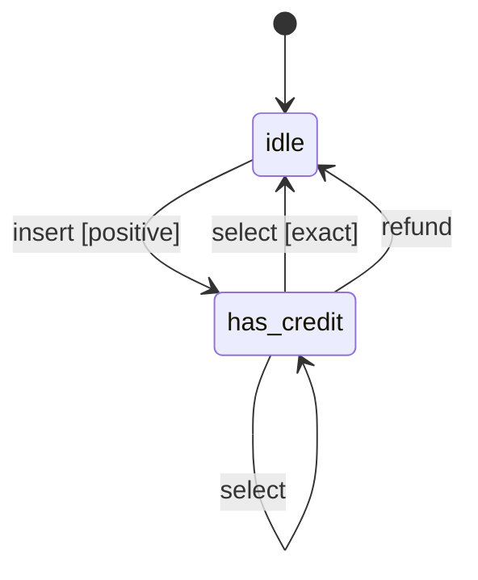

# vendingMachine

```mermaid
stateDiagram-v2
  state "idle" as vendingMachine_idle
  state "has_credit" as vendingMachine_has_credit
  [*] --> vendingMachine_idle
  vendingMachine_idle --> vendingMachine_has_credit : insert [positive]
  vendingMachine_has_credit --> vendingMachine_has_credit : insert [positive]
  vendingMachine_has_credit --> vendingMachine_idle : select [exact]
  vendingMachine_has_credit --> vendingMachine_has_credit : select [enough]
  vendingMachine_has_credit --> vendingMachine_has_credit : select
  vendingMachine_has_credit --> vendingMachine_idle : refund
```
