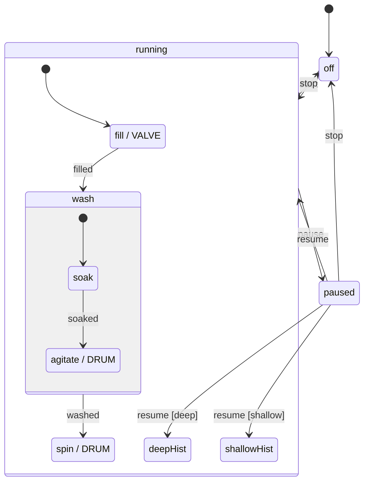

# washer

```mermaid
stateDiagram-v2
  state "off" as washer_off
  state "running" as washer_running {
    state "fill / VALVE" as washer_running_fill
    state "wash" as washer_running_wash {
      state "soak" as washer_running_wash_soak
      state "agitate / DRUM" as washer_running_wash_agitate
      [*] --> washer_running_wash_soak
    }
    state "spin / DRUM" as washer_running_spin
    state "deepHist" as washer_running_deepHist
    state "shallowHist" as washer_running_shallowHist
    [*] --> washer_running_fill
  }
  state "paused" as washer_paused
  [*] --> washer_off
  washer_running_wash_soak --> washer_running_wash_agitate : soaked
  washer_running_fill --> washer_running_wash : filled
  washer_running_wash --> washer_running_spin : washed
  washer_off --> washer_running : start
  washer_running --> washer_paused : pause
  washer_running --> washer_off : stop
  washer_paused --> washer_running_deepHist : resume [deep]
  washer_paused --> washer_running_shallowHist : resume [shallow]
  washer_paused --> washer_running : resume
  washer_paused --> washer_off : stop
```
