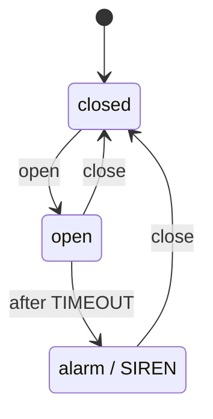

# doorAlarm (docs/fsm/timed.md)

```mermaid
stateDiagram-v2
  state "closed" as doorAlarm_closed
  state "open" as doorAlarm_open
  state "alarm / SIREN" as doorAlarm_alarm
  [*] --> doorAlarm_closed
  doorAlarm_closed --> doorAlarm_open : open
  doorAlarm_open --> doorAlarm_closed : close
  doorAlarm_open --> doorAlarm_alarm : after TIMEOUT
  doorAlarm_alarm --> doorAlarm_closed : close
```
