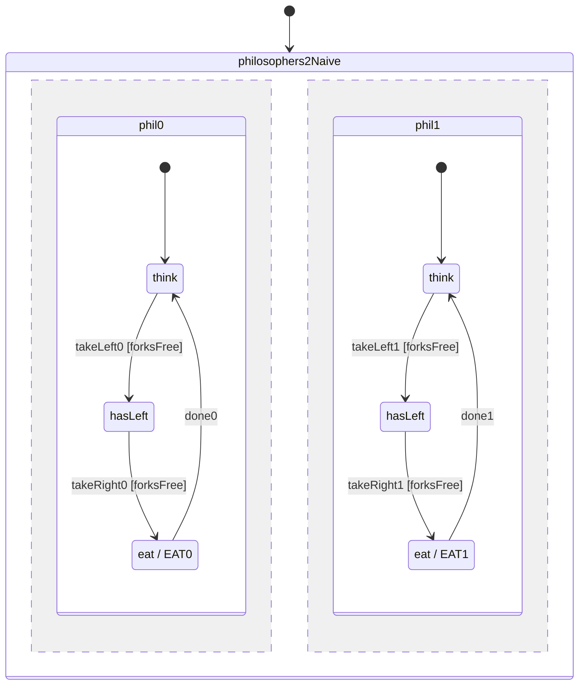

# philosophers n=2 naive (docs/petri/examples.md)

```mermaid
stateDiagram-v2
  state "philosophers2Naive" as philosophers2Naive {
    state "phil0" as philosophers2Naive_phil0 {
      state "think" as philosophers2Naive_phil0_think
      state "hasLeft" as philosophers2Naive_phil0_hasLeft
      state "eat / EAT0" as philosophers2Naive_phil0_eat
      [*] --> philosophers2Naive_phil0_think
      philosophers2Naive_phil0_think --> philosophers2Naive_phil0_hasLeft : takeLeft0 [forksFree]
      philosophers2Naive_phil0_hasLeft --> philosophers2Naive_phil0_eat : takeRight0 [forksFree]
      philosophers2Naive_phil0_eat --> philosophers2Naive_phil0_think : done0
    }
    --
    state "phil1" as philosophers2Naive_phil1 {
      state "think" as philosophers2Naive_phil1_think
      state "hasLeft" as philosophers2Naive_phil1_hasLeft
      state "eat / EAT1" as philosophers2Naive_phil1_eat
      [*] --> philosophers2Naive_phil1_think
      philosophers2Naive_phil1_think --> philosophers2Naive_phil1_hasLeft : takeLeft1 [forksFree]
      philosophers2Naive_phil1_hasLeft --> philosophers2Naive_phil1_eat : takeRight1 [forksFree]
      philosophers2Naive_phil1_eat --> philosophers2Naive_phil1_think : done1
    }
  }
  [*] --> philosophers2Naive
```
