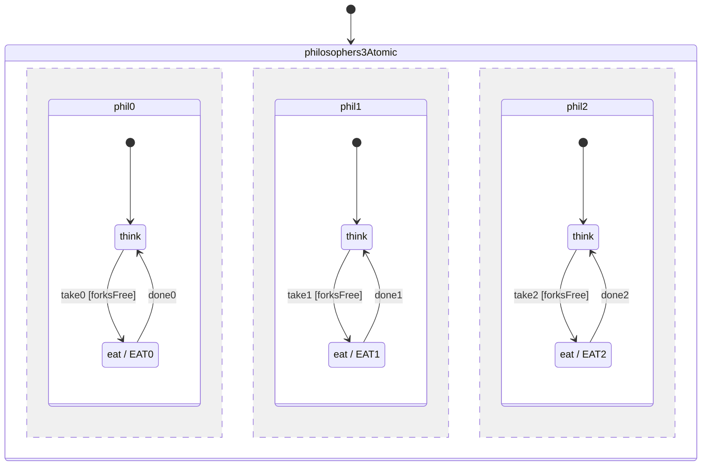

# philosophers n=3 atomic (docs/petri/examples.md)

```mermaid
stateDiagram-v2
  state "philosophers3Atomic" as philosophers3Atomic {
    state "phil0" as philosophers3Atomic_phil0 {
      state "think" as philosophers3Atomic_phil0_think
      state "eat / EAT0" as philosophers3Atomic_phil0_eat
      [*] --> philosophers3Atomic_phil0_think
      philosophers3Atomic_phil0_think --> philosophers3Atomic_phil0_eat : take0 [forksFree]
      philosophers3Atomic_phil0_eat --> philosophers3Atomic_phil0_think : done0
    }
    --
    state "phil1" as philosophers3Atomic_phil1 {
      state "think" as philosophers3Atomic_phil1_think
      state "eat / EAT1" as philosophers3Atomic_phil1_eat
      [*] --> philosophers3Atomic_phil1_think
      philosophers3Atomic_phil1_think --> philosophers3Atomic_phil1_eat : take1 [forksFree]
      philosophers3Atomic_phil1_eat --> philosophers3Atomic_phil1_think : done1
    }
    --
    state "phil2" as philosophers3Atomic_phil2 {
      state "think" as philosophers3Atomic_phil2_think
      state "eat / EAT2" as philosophers3Atomic_phil2_eat
      [*] --> philosophers3Atomic_phil2_think
      philosophers3Atomic_phil2_think --> philosophers3Atomic_phil2_eat : take2 [forksFree]
      philosophers3Atomic_phil2_eat --> philosophers3Atomic_phil2_think : done2
    }
  }
  [*] --> philosophers3Atomic
```
