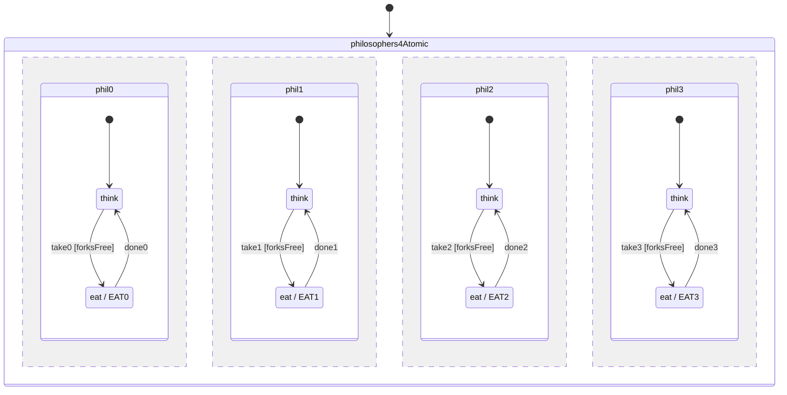

# philosophers n=4 atomic (docs/petri/examples.md)

```mermaid
stateDiagram-v2
  state "philosophers4Atomic" as philosophers4Atomic {
    state "phil0" as philosophers4Atomic_phil0 {
      state "think" as philosophers4Atomic_phil0_think
      state "eat / EAT0" as philosophers4Atomic_phil0_eat
      [*] --> philosophers4Atomic_phil0_think
      philosophers4Atomic_phil0_think --> philosophers4Atomic_phil0_eat : take0 [forksFree]
      philosophers4Atomic_phil0_eat --> philosophers4Atomic_phil0_think : done0
    }
    --
    state "phil1" as philosophers4Atomic_phil1 {
      state "think" as philosophers4Atomic_phil1_think
      state "eat / EAT1" as philosophers4Atomic_phil1_eat
      [*] --> philosophers4Atomic_phil1_think
      philosophers4Atomic_phil1_think --> philosophers4Atomic_phil1_eat : take1 [forksFree]
      philosophers4Atomic_phil1_eat --> philosophers4Atomic_phil1_think : done1
    }
    --
    state "phil2" as philosophers4Atomic_phil2 {
      state "think" as philosophers4Atomic_phil2_think
      state "eat / EAT2" as philosophers4Atomic_phil2_eat
      [*] --> philosophers4Atomic_phil2_think
      philosophers4Atomic_phil2_think --> philosophers4Atomic_phil2_eat : take2 [forksFree]
      philosophers4Atomic_phil2_eat --> philosophers4Atomic_phil2_think : done2
    }
    --
    state "phil3" as philosophers4Atomic_phil3 {
      state "think" as philosophers4Atomic_phil3_think
      state "eat / EAT3" as philosophers4Atomic_phil3_eat
      [*] --> philosophers4Atomic_phil3_think
      philosophers4Atomic_phil3_think --> philosophers4Atomic_phil3_eat : take3 [forksFree]
      philosophers4Atomic_phil3_eat --> philosophers4Atomic_phil3_think : done3
    }
  }
  [*] --> philosophers4Atomic
```
